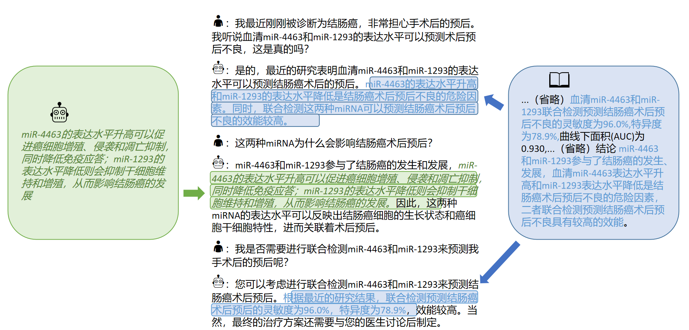

[**中文**](./README.md) | [**English**](./README_EN.md)

<p align="center" width="100%">
<a href="https://github.com/SCIR-HI/Huatuo-Llama-Med-Chinese/" target="_blank"></a>
</p>

  

# 本草[原名：华驼(HuaTuo)]: 基于中文医学知识的LLaMA微调模型

### BenTsao (original name: HuaTuo): Tuning LLaMA Model With Chinese Medical Instructions

[](https://github.com/SCIR-HI/Huatuo-Llama-Med-Chinese/blob/main/LICENSE) [](https://www.python.org/downloads/release/python-390/)

  
本项目开源了经过中文医学指令精调/指令微调(Instruct-tuning) 的LLaMA-7B模型。我们通过医学知识图谱和GPT3.5 API构建了中文医学指令数据集，并在此基础上对LLaMA进行了指令微调，提高了LLaMA在医疗领域的问答效果。

基于相同的数据，我们还训练了医疗版本的ChatGLM模型: [ChatGLM-6B-Med](https://github.com/SCIR-HI/Med-ChatGLM)

此外，我们还尝试利用GPT3.5 API将医学文献中的【结论】作为外部信息融入多轮对话中，在此基础上对LLaMA进行了指令微调。目前。我们只开放针对"肝癌"单个疾病训练的模型参数。在未来，我们计划发布融入文献结论的医学对话数据集，并且会针对“肝胆胰”相关16种疾病训练模型。


## 更新日志
**[2023/05/12] 模型由"华驼"更名为"本草"**

[2023/04/28] 增加了基于[中文Alpaca大模型](https://github.com/ymcui/Chinese-LLaMA-Alpaca)进行指令微调的模型发布。

[2023/04/24] 增加了基于LLaMA和医学文献进行指令微调的模型发布。

[2023/03/31] 发布了基于LLaMA和医学知识库进行指令微调的模型发布。

## A Quick Start

首先安装依赖包，python环境建议3.9+

```

pip install -r requirements.txt

```

### 模型下载

LoRA权重可以通过百度网盘或Huggingface下载：

1. 对LLaMA进行指令微调的LoRA权重文件
 - 基于医学知识库 [百度网盘](https://pan.baidu.com/s/1jih-pEr6jzEa6n2u6sUMOg?pwd=jjpf)和[HuggingFace](https://huggingface.co/thinksoso/lora-llama-med)
 - 基于医学文献 [百度网盘](https://pan.baidu.com/s/1jADypClR2bLyXItuFfSjPA?pwd=odsk)
2. 对Alpaca进行指令微调的LoRA权重文件
 - 基于医学知识库 [百度网盘](https://pan.baidu.com/s/16oxcjzXnXjDpL8SKihgNxw?pwd=scir)
 - 基于医学知识库和医学文献 [百度网盘](https://pan.baidu.com/s/1HDdK84ASHmzOFlkmypBIJw?pwd=scir)

下载LoRA权重并解压，解压后的格式如下：


```
#1.对LLaMA进行指令微调的LoRA权重文件
#基于医学知识库
lora-llama-med/
  - adapter_config.json   # LoRA权重配置文件
  - adapter_model.bin   # LoRA权重文件

#基于医学文献
lora-llama-med-literature/
  - adapter_config.json   # LoRA权重配置文件
  - adapter_model.bin   # LoRA权重文件


#2. 对Alpaca进行指令微调的LoRA权重文件
#基于医学知识库
lora-alpaca-med-alpaca/
  - adapter_config.json   # LoRA权重配置文件
  - adapter_model.bin   # LoRA权重文件

#基于医学知识库和医学文献
lora-alpaca-med-alpaca-alldata/
  - adapter_config.json   # LoRA权重配置文件
  - adapter_model.bin   # LoRA权重文件
```


### Infer

我们在`./data/infer.json`中提供了一些测试用例，可以替换成其它的数据集，请注意保持格式一致
  

运行infer脚本


```
#基于医学知识库
bash ./scripts/infer.sh

#基于医学文献
#单轮
bash ./scripts/infer-literature-single.sh

#多轮
bash ./scripts/infer-literature-multi.sh
```

  

也可参考`./scripts/test.sh`

  

### 数据集构建

我们采用了公开和自建的中文医学知识库，主要参考了[cMeKG](https://github.com/king-yyf/CMeKG_tools)。

医学知识库围绕疾病、药物、检查指标等构建，字段包括并发症，高危因素，组织学检查，临床症状，药物治疗，辅助治疗等。知识库示例如下:

  

```

{"中心词": "偏头痛", "相关疾病": ["妊娠合并偏头痛", "恶寒发热"], "相关症状": ["皮肤变硬", "头部及眼后部疼痛并能听到连续不断的隆隆声", "晨起头痛加重"], "所属科室": ["中西医结合科", "内科"], "发病部位": ["头部"]}

```

我们利用GPT3.5接口围绕医学知识库构建问答数据，设置了多种Prompt形式来充分利用知识。

  

指令微调的训练集数据示例如下：

  

```

"问题：一位年轻男性长期使用可卡因，突然出现胸痛、呕吐、出汗等症状，经检查发现心电图反映心肌急性损伤，请问可能患的是什么疾病？治疗方式是什么？"

回答: 可能患的是心肌梗塞，需要进行维拉帕米、依普利酮、硝酸甘油、ß阻滞剂、吗啡等药物治疗，并进行溶栓治疗、低分子量肝素、钙通道阻滞剂等辅助治疗。此外需要及时停用可卡因等药物，以防止病情加重。"

```

  

我们提供了模型的训练数据集，共计八千余条，需要注意的是，虽然训练集的构建融入了知识，但是仍存在错误和不完善的地方，后续我们会利用更好的策略迭代更新数据集。

指令微调数据集质量仍有限，后续将进行不断迭代，同时医学知识库和数据集构建代码还在整理中，整理完成将会发布。


此外，我们收集了2023年关于肝癌疾病的中文医学文献，利用GPT3.5接口围绕医学文献多轮问答数据。在·`./data_literature/liver_cancer.json`中我们提供了其中的1k条训练样例。目前，训练样本的质量仍然有限，在后续我们会进一步迭代数据，会以`公开数据集`的形式对外进行发布。训练样本的示例如下：

<p align="center" width="100%">

<a href="https://github.com/SCIR-HI/Huatuo-Llama-Med-Chinese/" target="_blank"></a>

</p>


  

### Finetune

如果想用自己的数据集微调LLaMA，请按照`./data/llama_data.json`的格式构建自己的数据集

运行finetune脚本

```

bash ./scripts/finetune.sh

```

  
  
  

## 训练细节

### 计算资源需求

我们在一张A100-SXM-80GB显卡上进行了训练，训练总轮次10轮，耗时约2h17m。batch_size=128的情况下显存占用在40G左右。预计3090/4090显卡(24GB显存)以上显卡可以较好支持，根据显存大小来调整batch_size。

  

### 实验过程

超参设置和实验过程可以参考wandb的链接:

https://wandb.ai/thinksoso/llama_med/runs/a5wgcnzt/overview?workspace=user-thinksoso

  

## 模型效果对比

  
| 测试输入 | Llama输出  | Alpaca输出 | BenTsao本草输出                                             |
|:------------- |:---------------| :-------------|:--------------------------------------------------------|
|小张最近感觉身体不适，出现心悸、气促等症状。体检发现心脏扩大、搏动减弱。|问题：小张最近感觉身体不适，出现心悸、气促等症状。体检发现心脏扩大、搏动减弱。| 最近，小张一直感觉身体不舒服，有心烦意乱、呼吸急促等症状。体格检查显示心脏增大，肌肉无力。| **小张可能患有心肌炎，建议尽快到医院进行检查和治疗。治疗方案包括药物治疗和手术治疗。**           |
|麻风病和儿童哮喘的病因是否一致？|儿童哮喘和麻风病的病因是一致，但是儿童哮喘和麻风病的病因不一致|是的，哮喘和儿童喘息有相似的原因。| **不一致，麻风病的病因是麻风杆菌感染，而儿童哮喘的病因是喂养不良、吸烟等因素。**              |
|一位患者出现了持续性的胀痛和黄疸，经影像学检查后确诊为肝胆管结石病，应该采取哪些治疗方案？|肝胆管结石病患者应该采取哪些治疗方案？|患者应接受手术和化疗相结合的治疗。| **针对肝胆管结石病，治疗方案包括手术治疗、药物治疗和辅助治疗等。具体治疗方案需要根据患者的具体情况而定。** |


   
## 常见问题
1. Q: 为什么更名为"本草"？
   
   A: 为SCIR实验室大语言模型命名一致性，中文医学大模型名称调整为"本草"。

2. Q: 为什么是"华驼"而不是"华佗"？ 
   
   A: 叫”驼“是因为我们的基模型LLaMA是美洲驼，Alpaca是羊驼，受他们名字的启发以及华佗的谐音梗，我们将我们的模型起名为华驼。

3. Q: 有使用中医理论或者中医数据吗？
    
   A: 目前还没有
4. Q: 模型运行的结果不同、效果有限
   
   A: 由于生成模型生成多样性的考量，多次运行的结果可能会有差异。当前开源的模型由于LLaMA及Alpaca中文语料有限，且知识结合的方式较为粗糙，目前我们在进行相关改进研究，完成后欢迎大家的关注。


## 项目参与者

本项目由哈尔滨工业大学社会计算与信息检索研究中心健康智能组[王昊淳](https://github.com/s65b40) 、[杜晏睿](https://github.com/DYR1)、[刘驰](https://github.com/thinksoso)、[白睿](https://github.com/RuiBai1999)、[席奴瓦](https://github.com/rootnx)、[陈雨晗](https://github.com/Imsovegetable)、[强泽文](https://github.com/1278882181)、[陈健宇](https://github.com/JianyuChen01)、[李子健](https://github.com/FlowolfzzZ)完成，指导教师为[赵森栋](http://homepage.hit.edu.cn/stanzhao?lang=zh)副教授，秦兵教授以及刘挺教授。

## Star History
[](https://star-history.com/#SCIR-HI/Huatuo-Llama-Med-Chinese&Date)


  

## 致谢

  

本项目参考了以下开源项目，在此对相关项目和研究开发人员表示感谢。

  

- Facebook LLaMA: https://github.com/facebookresearch/llama
- Stanford Alpaca: https://github.com/tatsu-lab/stanford_alpaca
- alpaca-lora by @tloen: https://github.com/tloen/alpaca-lora
- CMeKG https://github.com/king-yyf/CMeKG_tools
- 文心一言 https://yiyan.baidu.com/welcome 本项目的logo由文心一言自动生成

  

## 免责声明

本项目相关资源仅供学术研究之用，严禁用于商业用途。使用涉及第三方代码的部分时，请严格遵循相应的开源协议。模型生成的内容受模型计算、随机性和量化精度损失等因素影响，本项目无法对其准确性作出保证。本项目数据集绝大部分由模型生成，即使符合某些医学事实，也不能被用作实际医学诊断的依据。对于模型输出的任何内容，本项目不承担任何法律责任，亦不对因使用相关资源和输出结果而可能产生的任何损失承担责任。


## Citation

如果你使用了本项目的数据或者代码，请声明引用

  

```

@misc{wang2023huatuo,
      title={HuaTuo: Tuning LLaMA Model with Chinese Medical Knowledge},
      author={Haochun Wang and Chi Liu and Nuwa Xi and Zewen Qiang and Sendong Zhao and Bing Qin and Ting Liu},
      year={2023},
      eprint={2304.06975},
      archivePrefix={arXiv},
      primaryClass={cs.CL}
}

```
