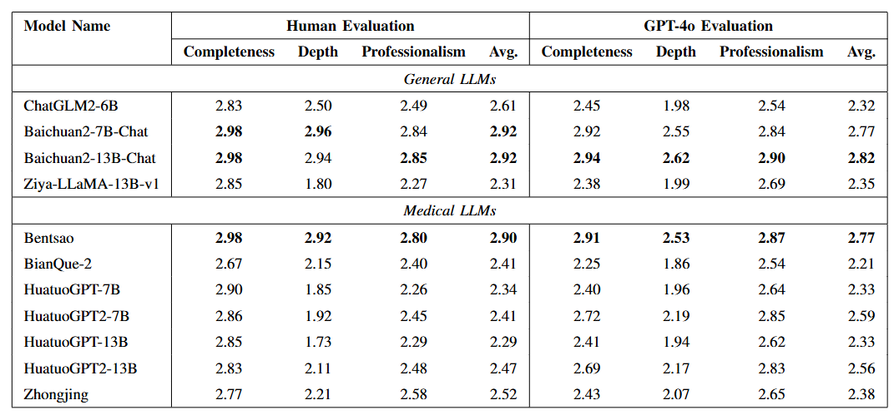

##评价基准
我们提出了中文医学复杂开放式问题回答基准（CMCOQA），旨在通过在医疗场景中构建复杂的开放式问题来更准确、有效地评估大语言模型的医学水平。  
###基准构建
我们首先手动构建了100个复杂的医学问题，并通过GPT-4结合Self-Instruct方法扩展至1200个问题，形成CMCOQA基准。并依据ICD-10标准进行问题分类，对某些类别进行调整，以确保数据集涵盖了各种疾病，且分布相对均衡。   
 - [CMCOQA基准数据集样例](question.json)
###评价维度
CMCOQA基准涉及三个评估维度：完整性（Completeness）、深刻性（Depth）和专业性（Professionalism）。在每个维度按照下表的评分标准，使用0到3分进行评分。

| 维度        | 标准        | 描述                                   |
|:----------:|:----------:|:------------------------------------:|
| 完整性      | 覆盖度      | 涵盖问题的各个方面，例如病因、诊断、治疗和预防。 |
|            | 相关性      | 与问题直接相关，避免无关信息。              |
| 深刻性      | 分析深度     | 提供深入的分析和讨论，而不仅仅是表面的描述。  |
|            | 见解      | 提供建设性的建议或观点。                  |
| 专业性      | 准确性      | 确保内容准确，避免错误或误导性内容。         |
|            | 简洁性      | 言简意赅，直奔主题，没有冗余信息。          |
|            | 术语使用     | 恰当使用专业术语，展现专业水平。            |

###评价结果
我们使用人工和GPT-4o结合的方式，使用CMCOQA基准对一系列医学大模型以及通用领域大模型进行评估，可以看到，在医学大模型领域，基于知识微调的本草大模型表现优异，尤其在回复的深刻性方面，显著优于其他基线。

